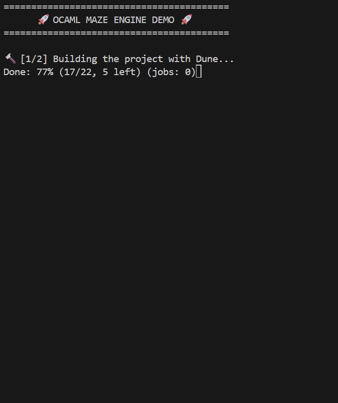

# 🚀 OCaml Maze Engine


A high-performance algorithmic project written entirely in **OCaml**. It generates perfect random mazes using depth-first search (DFS) and solves them with a backtracking algorithm. The engine features a custom terminal rendering system with ANSI colors and live animation capabilities.

## 👁️ Live Action

Watch the algorithm build and solve the maze in real-time:

<p align="center">
  
</p>

## ⚡ Try it instantly (No installation required)

You can test this project directly in your browser without installing anything. Click the button below to launch a fully configured Linux environment via GitHub Codespaces:

[](https://codespaces.new/ArThOxo/ocaml-maze-engine)

Once the terminal opens, simply run the automated cinematic demo:
```bash
./demo.sh

